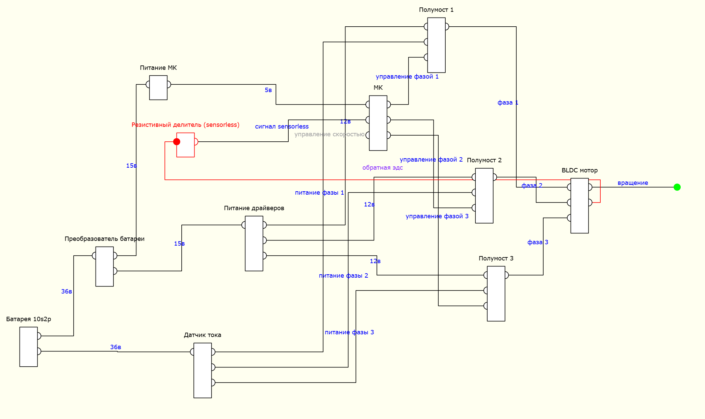

# Народный BLDC

[Народный BLDC. Идея.](https://dzen.ru/a/aAqzY3wL3hYH8thT)

[Народный BLDC. Силовые полумосты (драйверы).](https://dzen.ru/a/aA9xLvV5_mqxcvPD)

[Народный BLDC. Драйвер MOSFET. Реальный.](https://dzen.ru/a/aU5kGtLHgkQMpICG)

[Народный BLDC. Датчик тока. Анализ.](https://dzen.ru/a/aU6qCCslZkA4vVZp)

[Народный BLDC. Аварийный выключатель.](https://dzen.ru/a/aVVb1hDqaj0MYNcG)

[Народный BLDC. Proteus или «чистый спайс»?](https://dzen.ru/a/aV0lFx51Ij69v_pY)

[Народный BLDC. Емкость имеет значение](https://dzen.ru/a/afI2TXtb1k4rRjWv)

[Народный BLDC. Как поймать BEMF?](https://dzen.ru/a/ai6oYPS2zEHB-RZm)

---

[Функциональный базис](/knitter_db/) для формирования схемы с помощью ['Сшивки'](https://github.com/maxzawalo/knitter).
